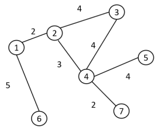
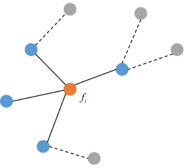

# 图的拉普拉斯矩阵

## 拉普拉斯算子

微积分中，多元函数的拉普拉斯算子是_所有自变量的非混合二阶偏导数之和_。

对于$f(x_1,...,x_n)$，拉普拉斯算子计算为：$\Delta f = \sum_{i=1}^{n}\frac{\partial^2f}{\partial x_i^2}$

对于三元函数$f(x,y,z)$的拉普拉斯算子计算为：$\Delta f =\frac{\partial^2 f}{\partial x^2} +  \frac{\partial^2 f}{\partial y^2} + \frac{\partial^2 f}{\partial z^2}$

* 对于单元函数在一点处的微分，可以用下式近似计算，若存在$\Delta x$接近于0，则在$x$处的一阶导可以用下式近似计算：$f'(x) \approx \frac{f(x+\Delta x)-f(x)}{\Delta x}$，二阶导有：

  $f''(x) \approx \frac{f'(x)-f'(x-\Delta x)}{\Delta x} \approx \frac{\frac{f(x+\Delta x) - f(x)}{\Delta x} - \frac{f(x)-f(x-\Delta x)}{\Delta x}}{\Delta x} = \frac{f(x+\Delta x) + f(x-\Delta x)-2f(x)}{(\Delta x)^2}$

* 对于多元函数，例如$f(x,y)$，其拉普拉斯算子可以用下面的公式近似计算：

  $\Delta f = \frac{\part^2 f}{\part x^2} + \frac{\part^2 f}{\part y^2} \approx \frac{f(x+\Delta x, y)+f(x-\Delta x,y)-2f(x,y)}{(\Delta x)^2} + \frac{f(x,y+\Delta y)+f(x, y-\Delta y)-2f(x,y)}{(\Delta x)^2}$

考虑二元函数的离散化，即在一系列整实数处采样，得到一系列点的函数值，构成一个矩阵：

$\begin{bmatrix} f(x_1,y_1),f(x_2,y_1),...,f(x_n,y_1) \\  f(x_2,y_2),f(x_2,y_2),...,f(x_n,y_2) \\ ... \\ f(x_1,y_n),f(x_2,y_n),...,f(x_n,y_n) \end{bmatrix}$

所以在上述描述微分中，$x$表示了水平方向，$y$表示了垂直方向，为了使结果更加明显，使$\Delta x = 1$，可得$x_i+\Delta x =x_{i+1},y_j+\Delta y=y_{j+1}$，则上述多元函数的拉普拉斯算子简化为：

$\frac{f(x_i+\Delta x, y_j)+f(x_i-\Delta x,y_j)-2f(x_i,y_j)}{(\Delta x)^2} + \frac{f(x_i,y_j+\Delta y)+f(x_i, y_j-\Delta y)-2f(x_i,y_j)}{(\Delta x)^2}\hfill \\ = \frac{f(x_{i+1},y_j)+f(x_{i-1},y_j)-2f(x_i,y_j)}{1^2} + \frac{f(x_i,y_{j+1})+f(x_i,y_{j-1})-2f(x_i,y_j)}{1^2}\hfill \\= f(x_{i+1},y_j)+f(x_{i-1}, y_j) + f(x_i,y_{j+1}) + f(x_i,y_{j-1})-4f(x_i,y_j)\hfill$

从上式可得，二元函数$f(x,y)$的拉普拉斯算子就是$(x_i,y_j)$的相邻点函数之和与本身4倍的差值。将每个邻域点与本身点的差值组合可转换为下式：

$\Delta f = \sum_{(k,l) \in N(i,j)}(f(x_k,y_l) - f(x_i,y_j))$

$N(i,j)$表示点$(x_i,y_j)$的邻域。

## 图的邻接矩阵与度矩阵

如图所示为一简单图：

其邻接矩阵$W$表示为：

$\begin{bmatrix} 0 & 2 & 0 & 0 & 0 & 5 & 0 \\ 2 & 0 & 4 & 3 & 0 & 0 & 0 \\ 0 & 4 & 0 & 4 & 0 & 0 & 0 \\ 0 & 3 & 4 & 0 & 4 & 0 & 2 \\ 0 & 0 & 0 & 4 & 0 & 0 & 0 \\ 5 & 0 & 0 & 0 & 0 & 0 & 0 \\ 0 & 0 & 0 & 2 & 0 & 0 & 0 \end{bmatrix}$

是一个对称矩阵，节点$i$的度表示为邻接矩阵第$i$行元素之和：$d_i=\sum_{i=1}^{n}w_{ij}$，其度矩阵是对角阵，对角元素为$d_{ii} = d_i$，度矩阵表示为：

$\begin{bmatrix} 7 & 0 & 0 & 0 & 0 & 0 & 0 \\ 0 & 9 & 0 & 0 & 0 & 0 & 0 \\ 0 & 0 & 8 & 0 & 0 & 0 & 0 \\ 0 & 0 & 0 & 13 & 0 & 0 & 0 \\ 0 & 0 & 0 & 0 & 4 & 0 & 0 \\ 0 & 0 & 0 & 0 & 0 & 5 & 0 \\ 0 & 0 & 0 & 0 & 0 & 0 & 2 \end{bmatrix}$

借助在二元函数中的拉普拉斯算子描述，将拉普拉斯算子推广到图中，在顶点$i$处的拉普拉斯算子计算为：

$\Delta f_i=\sum_{j\in N_i}(f_i - f_j)$

由于图中的点与点之间的边存在权重，将权重加入上述公式后变为：

$\Delta f_i=\sum_{j\in N_i}w_{ij}(f_i - f_j)$

在图中可描述为：

从图中看出，只有点$f_i$的一阶邻域的权重非0，所以在此简化上式为：

$\Delta f_i=\sum_{j \in V}w_{ij}(f_i - f_j) = \sum_{j\in V}w_{ij}f_i-\sum_{j\in V}w_{ij}f_j=d_if_i-W_iF$

对于图中所用点：

$\Delta f = \begin{bmatrix} d1f_1-W_1F \\ d_df_2-W_2F \\ .. \\ d_nf_n - W_nF \end{bmatrix} = \begin{bmatrix} d_1 & 0 &...& 0 \\ 0 & d_2 & ... & 0 \\ ... & ... & ... & ... \\ 0 & 0 & ... & 0 \end{bmatrix} \begin{bmatrix} f_1 \\ f_2 \\ ... \\ f_n \end{bmatrix} - \begin{bmatrix}W_1 \\ W_2 \\ ... \\ W_n \end{bmatrix}\begin{bmatrix}F_1 \\ F_2 \\ ... \\ F_n \end{bmatrix} = DF-WF = (D-W)F$

由上述可定义拉普拉斯矩阵为__*度矩阵*__与__*邻接矩阵*__之差：$L=D-W$。由于$D$和$W$都为对称阵，则$L$也为对称阵。根据上述介绍，拉普拉斯矩阵实际代表了图的二阶导，第一个图的拉普拉斯矩阵为：

$\begin{bmatrix} 7 & 0 & 0 & 0 & 0 & 0 & 0 \\ 0 & 9 & 0 & 0 & 0 & 0 & 0 \\ 0 & 0 & 8 & 0 & 0 & 0 & 0 \\ 0 & 0 & 0 & 13 & 0 & 0 & 0 \\ 0 & 0 & 0 & 0 & 4 & 0 & 0 \\ 0 & 0 & 0 & 0 & 0 & 5 & 0 \\ 0 & 0 & 0 & 0 & 0 & 0 & 2 \end{bmatrix} - \begin{bmatrix} 0 & 2 & 0 & 0 & 0 & 5 & 0 \\ 2 & 0 & 4 & 3 & 0 & 0 & 0 \\ 0 & 4 & 0 & 4 & 0 & 0 & 0 \\ 0 & 3 & 4 & 0 & 4 & 0 & 2 \\ 0 & 0 & 0 & 4 & 0 & 0 & 0 \\ 5 & 0 & 0 & 0 & 0 & 0 & 0 \\ 0 & 0 & 0 & 2 & 0 & 0 & 0 \end{bmatrix} = \begin{bmatrix} 7 & -2 & 0 & 0 & 0 & -5 & 0 \\ -2 & 9 & -4 & -3 & 0 & 0 & 0 \\ 0 & -4 & 8 & -4 & 0 & 0 & 0 \\ 0 & -3 & -4 & 13 & -4 & 0 & -2 \\ 0 & 0 & 0 & -4 & 4 & 0 & 0 \\ -5 & 0 & 0 & 0 & 0 & 5 & 0 \\ 0 & 0 & 0 & -2 & 0 & 0 & 2 \end{bmatrix}$

### 归一化拉普拉斯矩阵

定义为：$L_{sym}=D^{-1/2}LD^{-1/2}=I-D^{-1/2}WD^{-1/2}$